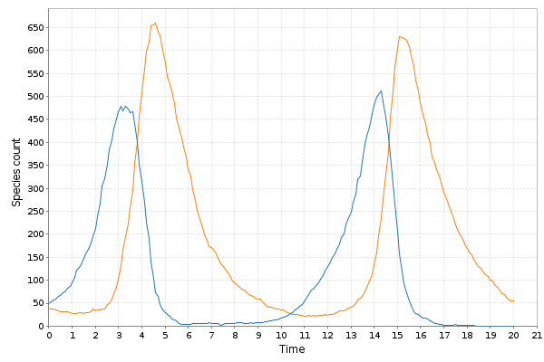

# scala-smfsb

### Scala library for biochemical network simulation, associated with the 3rd edition of the textbook Stochastic Modelling for Systems Biology


**This library is now ready to use, but is still undergoing rapid development, with regular updates likely until the end of 2018, by which time it should have approximate feature parity with the R package `smfsb`**

* The current *stable* version of this library is "0.4"
* The current unstable *snapshot* release of this library is "0.5-SNAPSHOT"

Binaries are published to Sonatype, cross-built for Scala 2.11.x and 2.12.x.

## Quickstart

* To use this software library, you should first install a recent [JDK](http://www.oracle.com/technetwork/java/javase/downloads) and [Sbt](http://www.scala-sbt.org/).
* Run `sbt` from an empty/temp directory
* At the `sbt` prompt, enter:
```scala
set libraryDependencies += "com.github.darrenjw" %% "scala-smfsb" % "0.4"
set libraryDependencies += "org.scalanlp" %% "breeze-viz" % "0.13.2"
set scalaVersion := "2.12.6"
console
```
* You should now have a Scala REPL with a dependency on this library. At the Scala REPL, enter the following:
```scala
import smfsb._
import breeze.linalg._
val model = SpnModels.lv[IntState]()
val step = Step.gillespie(model)
val ts = Sim.ts(DenseVector(50, 40), 0.0, 20.0, 0.1, step)
Sim.plotTs(ts)
```
* This should simulate a trajectory from a Lotka-Volterra model and plot the result in a window on the console which looks a little bit like the following:



To get the most out of this library, it will be helpful if you are already familiar with the R package [smfsb](https://cran.r-project.org/package=smfsb) associated with the (2nd or) 3rd edition of the textbook [Stochastic modelling for systems biology](https://github.com/darrenjw/smfsb/), and have a basic familiarity with [Scala](https://www.scala-lang.org/) and [Breeze](https://github.com/scalanlp/breeze). For those new to Scala, my course on [Scala for statistical computing](https://github.com/darrenjw/scala-course/blob/master/SelfStudyGuide.md) is a good place to start.

## Documentation

* [Tutorial](docs/Tutorial.md) - walk through of basic functionality
* There are more interesting examples in the [examples directory](examples/). To run them, download or clone the repo, and do `sbt run` from *inside* the examples directory.
* [Latest API docs](https://darrenjw.github.io/scala-smfsb/api/smfsb/index.html)

## Using the library in your own Scala projects

### Stable:

Just add:
```scala
"com.github.darrenjw" %% "scala-smfsb" % "0.4"
```
to your Sbt dependencies. You might also need to add an explicit dependence on `breeze-viz`:
```scala
"org.scalanlp" %% "breeze-viz" % "0.13.2"
```

### Snapshot:

Just add something like:
```scala
libraryDependencies += "com.github.darrenjw" %% "scala-smfsb" % "0.5-SNAPSHOT"
resolvers += "Sonatype Snapshots" at
    "https://oss.sonatype.org/content/repositories/snapshots/"
```
to your Sbt build file.

## Building from source

Download or clone the repo and do:
```scala
sbt clean compile test doc package
```
from the top-level directory.

